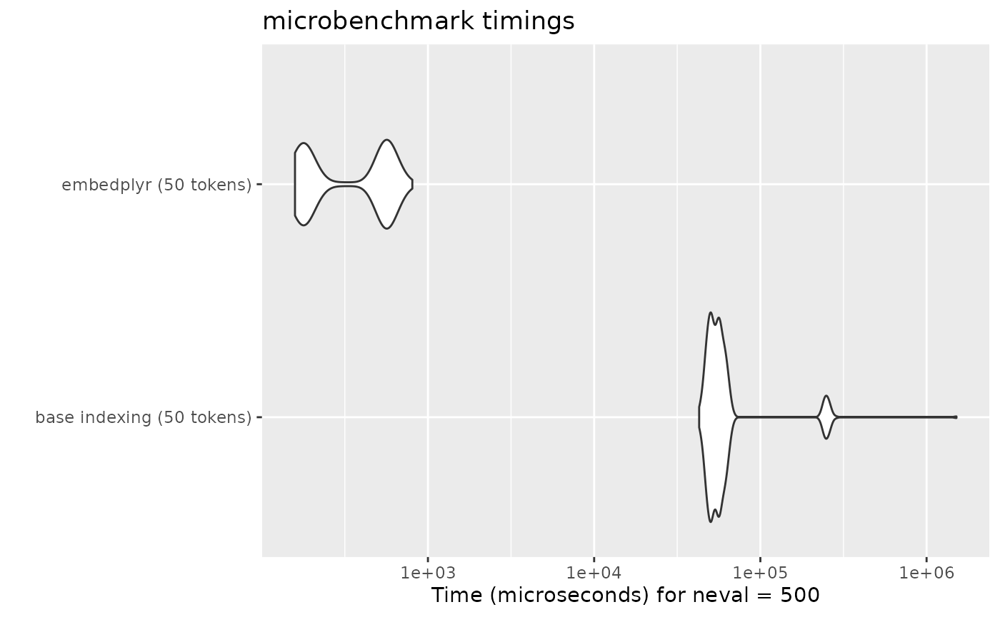

# Performance Benchmark

``` r
library(embedplyr)
library(microbenchmark)
library(ggplot2)
```

Whereas indexing a regular matrix by rownames gets slower as the number
of rows increases, embedplyr’s hash table indexing means that token
embeddings can be retrieved in roughly constant time. The following test
uses `glove.twitter.27B.25d`, which has 1.2 million rows (by no means
the largest model available).

``` r
glove_embeddings <- load_embeddings("glove.twitter.27B.25d", save = FALSE)
#> Reading file from the Internet...
glove_matrix <- as.matrix(glove_embeddings)
```

``` r
# 50 randomly sampled tokens
tokens <- rownames(glove_embeddings)[sample(seq_len(nrow(glove_embeddings)), 50)]

bm1 <- microbenchmark(
    "base indexing (50 tokens)" = glove_matrix[tokens,],
    "embedplyr (50 tokens)" = glove_embeddings[tokens,],
    times = 500
)
autoplot(bm1)
#> Warning: `aes_string()` was deprecated in ggplot2 3.0.0.
#> ℹ Please use tidy evaluation idioms with `aes()`.
#> ℹ See also `vignette("ggplot2-in-packages")` for more information.
#> ℹ The deprecated feature was likely used in the microbenchmark package.
#>   Please report the issue at
#>   <https://github.com/joshuaulrich/microbenchmark/issues/>.
#> This warning is displayed once every 8 hours.
#> Call `lifecycle::last_lifecycle_warnings()` to see where this warning was
#> generated.
```



When retrieving many token embeddings (e.g. when analyzing a set of
texts), this can make a noticeable difference.
